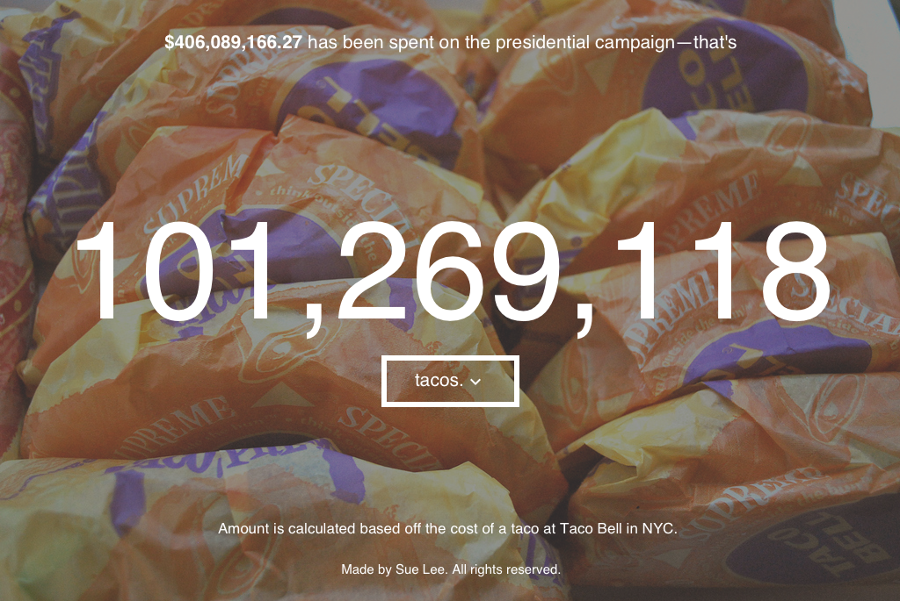

# campaign translator

Campaign Translator uses the [Sunlight Foundation][Sunlight Foundation] API to show people how much money has been spent on the 2016 United States Presidential Campaign so far as well as other ways that money could have been used. 

[Sunlight Foundation]: http://sunlightfoundation.com/

Here is an example:

